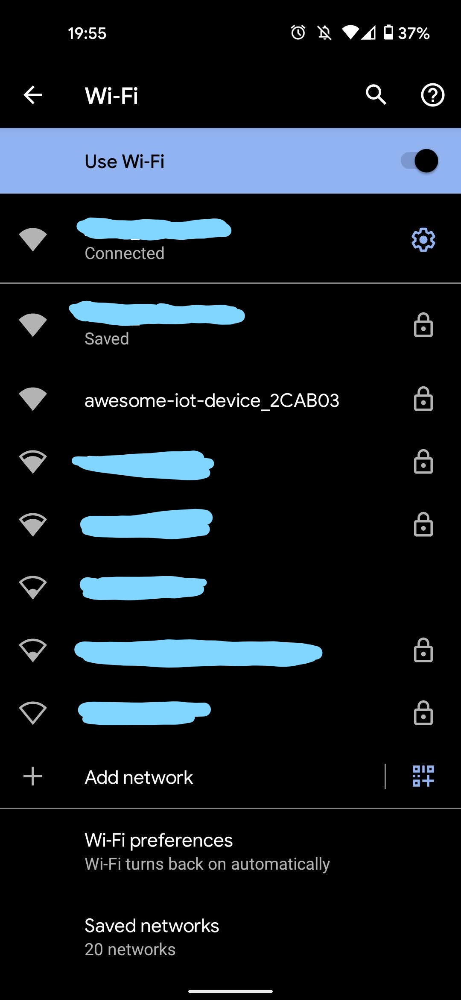
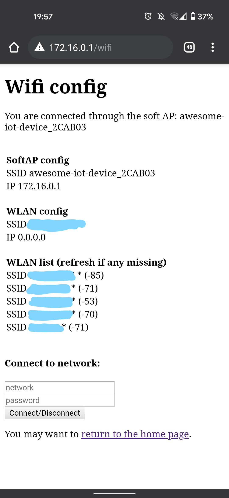

# wifimanager
wifi manager for esp devices to handle switching between AP/client mode

Mostly reused code from https://github.com/esp8266/Arduino/blob/master/libraries/DNSServer/examples/CaptivePortalAdvanced/CaptivePortalAdvanced.ino
but wrapped it in a class to make it nicer to use in my projects.

The WiFiManager class will enable the soft AP on the device when the host wifi connection is lost. 
The aim is to enable devices to be reachable if you change your main wifi settings and the IoT device drops off the network you can connect directly too it and update the wifi credentials which are then stored in the EEPROM for retrieval after rebooting. 

Typical serial monitor output when a wifi host cannot be reached

```
Booting...
WiFi failed, retrying.
WiFi failed, retrying.
WiFi failed, retrying.
WiFi failed, retrying.
WiFi failed, retrying.
WiFi failed, retrying.
WiFi failed, retrying.
WiFi failed, retrying.
WiFi failed, retrying.
WiFi failed, retrying.
WiFi failed, retrying.
Wifi status changed: Disconnected
Configuring access point...
In AP mode
Wifi status changed: No SSID
Already in AP mode
Wifi status changed: Disconnected
Already in AP mode
Wifi status changed: No SSID
Already in AP mode
```

Example of the device in AP mode




Connect to it and navigate to `http://172.16.0.1/wifi` to update the wifi credentials


